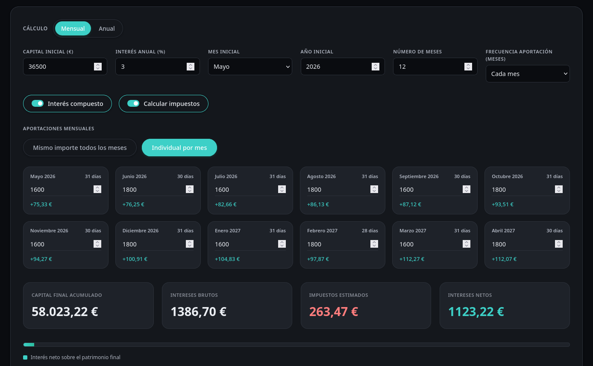

# 🏦 Calculadora de Intereses + Base Imponible del Ahorro

- [🏦 Calculadora de Intereses + Base Imponible del Ahorro](#-calculadora-de-intereses--base-imponible-del-ahorro)
  - [📷 Apariencia](#-apariencia)
  - [⚠️ Descargo de responsabilidad](#️-descargo-de-responsabilidad)
  - [🚀 Uso](#-uso)
  - [🧮 Características](#-características)
  - [⚙️ Modelo de cálculo](#️-modelo-de-cálculo)
  - [🤝 Cómo contribuir](#-cómo-contribuir)
  - [📄 Licencia](#-licencia)

Calculadora web para simular la evolución de un ahorro con interés simple o compuesto, aportaciones periódicas y estimación opcional de la fiscalidad de la base del ahorro en España.

La aplicación **funciona completamente offline y es 100% privada**: todos los cálculos se realizan en el lado del cliente, es decir, en tu navegador, sin enviar ni recibir datos de servidores externos. Además, el navegador recuerda localmente tu última configuración y simulación mediante `localStorage`, sin salir de tu equipo.

## 📷 Apariencia

  
<strong>Vista previa de la calculadora - Click en ella para verla al completo</strong>

  <a href="img/screenshot-fullpage.png" target="_blank">
    

      
    

  </a>

## ⚠️ Descargo de responsabilidad

Los resultados proporcionados por la herramienta son **meramente orientativos** y **no constituyen asesoramiento financiero ni fiscal**. La rentabilidad real puede verse afectada por comisiones, inflación, productos exentos, fechas de liquidación concretas, cambios normativos o circunstancias personales no contempladas en el modelo.

**Consulta siempre con un profesional antes de tomar decisiones económicas.**

## 🚀 Uso

1. Descarga el archivo [calculadora_intereses.html](calculadora_intereses.html) y ábrelo en tu navegador, o visita la versión alojada en mi servidor:

   [https://sh.juanje.net/inte](https://sh.juanje.net/inte)

2. Elige el tipo de vista según la cantidad de datos que quieras ver: `Simple` o `Detallada`.
3. Selecciona si quieres calcular por periodos `Mensual` o `Anual`.
4. Ajusta el saldo inicial, el interés anual, la fecha de inicio y la duración de la simulación.
5. Configura la frecuencia de aportación y decide si las aportaciones serán iguales en todos los periodos o distintas en cada uno.
6. Activa o desactiva `Interés compuesto` y `Calcular impuestos` según el escenario que quieras comparar.

La calculadora recuerda automáticamente en el mismo navegador la vista `Simple` o `Detallada`, el modo mensual o anual, la pestaña de gráfica seleccionada y el último escenario introducido, incluidas las aportaciones por periodo.

## 🧮 Características

- Simulación mensual o anual.
- Vista simple y detallada.
- Interés simple o compuesto.
- Aportaciones periódicas con modo global o individual por periodo.
- Cálculo del saldo acumulado, intereses brutos, impuestos estimados e intereses netos.
- Tabla de detalle por periodo con acumulados y totales por ejercicio.
- Gráficas integradas para evolución del patrimonio, intereses por periodo y vista combinada.
- Estimación opcional de la fiscalidad de la base del ahorro en España 2026.
- Reinicio automático del cálculo fiscal al cambiar de ejercicio fiscal.
- Tema claro y oscuro con detección automática del modo preferido en la primera visita.
- Persistencia local automática de la vista, las preferencias de cálculo y la última simulación usada en ese navegador.
- Funcionamiento offline, sin depender de servicios externos para los cálculos.

## ⚙️ Modelo de cálculo

La calculadora aplica un modelo simplificado:

- Parte de un saldo inicial y una TAE/TIN anual expresada como porcentaje nominal anual.
- Convierte el tipo anual al periodo elegido y calcula el interés generado en cada tramo.
- En `interés compuesto`, el interés neto generado se reinvierte en el siguiente periodo.
- En `interés simple`, el capital remunerado y los intereses acumulados se separan, aunque ambos cuentan para el patrimonio final.
- Las aportaciones pueden repetirse con una frecuencia fija o definirse de forma individual para cada periodo.
- Cuando los impuestos están activados, la herramienta estima la tributación aplicando la escala anual de la base del ahorro en España: 19%, 21%, 23%, 27% y 30% según tramo.
- La carga fiscal se recalcula por ejercicio, no como una retención bancaria mensual fija.
- Si desactivas impuestos, la calculadora muestra la rentabilidad bruta para comparar escenarios antes de fiscalidad.

El resultado mostrado es una estimación del patrimonio final y de la rentabilidad acumulada bajo esas hipótesis simplificadas.

## 🤝 Cómo contribuir

Originalmente hice esta herramienta para uso personal, pero creo que puede ser útil para más gente y por eso decidí publicarla.

Si detectas un problema o quieres proponer una mejora, te animo a abrir una [pull request](https://github.com/JuanJesusAlejoSillero/calculadora-intereses/pulls) con los cambios que harías o una [issue](https://github.com/JuanJesusAlejoSillero/calculadora-intereses/issues) describiendo el problema encontrado.

**¡Muchas gracias!**

## 📄 Licencia

Este proyecto se distribuye bajo la licencia **GNU Affero General Public License v3.0 (AGPL-3.0)**. Consulta el archivo [LICENSE](LICENSE) para el texto completo.
